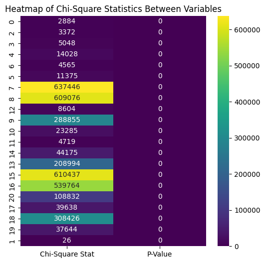

# Applying Machine Learning To Predict Crime Outcome In The USA

This project aims to explore the applicability of various machine learning models to predict whether a crime was solved, based on a comprehensive dataset. Through exploratory data analysis (EDA) and the implementation of multiple predictive models, the study seeks to enhance the understanding of factors influencing crime resolution.

## Project's Folder Structure

This project is organized into three folders, each serving a specific purpose. Below is the structure and description of these directories:

- `/plots`: houses all the plots generated as part of this project.

- `/notebooks`: contains all model calculations, including data preprocessing, model training, parameter tuning, and evaluation metrics.

## The dataset

The dataset used for this project is derived from the Murder Accountability Project, an extensively compiled database of homicides in the United States. It was downloaded from [Kaggle](https://www.kaggle.com/datasets/jyzaguirre/us-homicide-reports), and consists of more than 600k cases for the period between 1980 and 2014.

This resource stands as one of the most thorough compilations available, integrating detailed reports from the FBI’s Supplementary Homicide Report which spans from 1976 to the present. Additionally, it encompasses data obtained through the Freedom of Information Act, including over 22,000 homicide cases that were not officially reported to the Justice Department.

The data provides a granular view of each homicide case, cataloging critical details that include:

- **Record ID**: IDs of every crime.
- **Agency Code**: code of the agency.
- **Agency Name**: name of the agency.
- **Agency Type**: type of the reported agency.
- **City**: city in which the crime took place.
- **State**: state in which the crime took place.
- **Year**: year when the crime was commited.
- **Month**: month when the crime was commited.
- **Incident**: number of incidents.
- **Crime Type**: Murder or Manslaughter/Manslaughter by Negligence.
- **Crime Solved** yes or no.
- **Victim Sex** male or female.
- **Victim Age** age of the victim.
- **Victim Race** race of the victim.
- **Victim Ethnicity** Ethnicity of the victim.
- **Perpetrator Sex** male or female.
- **Perpetrator Age** perpetrator age.
- **Perpetrator Race** race of the perpetrator.
- **Perpetrator Ethnicity** ethnicity of the perpetrator.
- **Ralationship** relationship status between victim and perpetrator.
- **Weapon** weapon which has been used in the crime.
- **Victim Count** number of victims.
- **Perpetrator Count** number of perpetrators.
- **Record Source** souce of the information.

The dataset was assembled and made publicly accessible by the Murder Accountability Project, an initiative led by [Thomas Hargrove](https://www.murderdata.org/p/who-we-are.html) aimed at increasing transparency around homicide rates and justice efficacy in the United States. The project underscores the importance of open data in addressing social issues and enhancing accountability in criminal justice.

## Analysis

### Exploratory Data Analysis (EDA).

The Exploratory Data Analysis (EDA) conducted on the dataset provided insights into the relationships and correlations between various numerical and categorical variables.

Below are the summarized findings from both the numerical and categorical analyses:

#### Numerical Variables Insights:

- Strong Correlation with Perpetrator Age:
  A Spearman correlation test yielded a coefficient of 0.74, indicating a strong positive correlation between 'Perpetrator Age' and the likelihood of a crime being solved ('Crime Solved'). This suggests that older perpetrators are more likely to be involved in cases that are solved.
- The statistical significance of this correlation is affirmed by a p-value close to zero, dismissing the possibility of the correlation being a random occurrence within the sample.

#### Categorical Variables Insights

- Chi-Square Analysis:
  A refined range of Chi-Square values indicated significant, though less extreme, associations compared to initial analyses. The highest values are in the hundreds of thousands, pointing to substantive relationships.
- Perpetrator Sex: Exhibits the strongest connections with both 'Crime Solved' and 'Perpetrator Race', indicating the critical role of the perpetrator’s sex in the crime-solving process.
- Interpersonal Relationships: Significant associations were observed between 'Victim Sex' and 'Perpetrator Sex/Race', and 'Perpetrator Sex' and 'Relationship', emphasizing the impact of gender and relationship dynamics.
- Crime Type Correlations: Notable but less intense associations with 'Relationship' and 'Weapon', suggesting how different aspects of a crime interlink with crime types.

#### Relative Weaker Associations

- The association between 'Crime Type' and 'Victim Sex' although weaker, was still statistically significant. This underscores the importance of even subtle factors in the analysis of crime data.

### Machine Learning models to predict if a crime is solved.

In this project, I applied several machine learning models to predict the likelihood of a crime being solved. To avoid any racial and ethnical discrimination, I have omitted all columns that cause overfitting of the models, and I ended up with the following features - "Weapon", "Relationship", "Crime Solved", "Incident", "Crime Type", "Victim Count", "Perpetrator Count".

The main priority of my analysis is not to build a model with a high score but rather to have an ethical one.

I selected four primary models based on their suitability for binary classification tasks and their varied approaches to learning from data:

#### Logistic Regression:

- As a baseline model, logistic regression helps in understanding the linear relationships between the independent variables and the target binary outcome.
- A regularized logistic regression model was used to avoid overfitting, with hyperparameters adjusted based on cross-validation results.

#### Random Forest:

- This model is beneficial for handling nonlinear data with interactions between variables without requiring feature scaling.
- The Random Forest classifier was tuned for the number of trees, depth of trees, and minimum samples per leaf, ensuring a balance between bias and variance.

#### XGBoost:

- Known for its performance in classification challenges, XGBoost provides a robust way to handle unbalanced datasets.
- An optimized parameters such as learning rate, max depth, and min child weight to enhance model performance.

#### Decision Tree:

- Decision trees provide clear visualization of how decisions are made, which is valuable for interpretation and understanding feature importance.
- The tree depth, min samples split, and min samples leaf were carefully chosen to prevent overfitting while maintaining the model's interpretability.

#### Model Evaluation

Each model was evaluated based on several metrics to assess its effectiveness in predicting whether crimes were solved:

- Accuracy
- Precision
- Recall
- F1-Score
- Area Under the ROC Curve (AUC)

These metrics provided a comprehensive view of each model's performance, considering both the balance between classes and the cost of false positives versus false negatives.

## Findings

All models performed reasonably well, with XGBoost and Random Forest showing slightly better overall metrics due to their ensemble approaches that reduce variance and bias.

Logistic Regression and Decision Tree models, while slightly less accurate, offered greater interpretability, which can be crucial for policy-making and strategic decisions.
